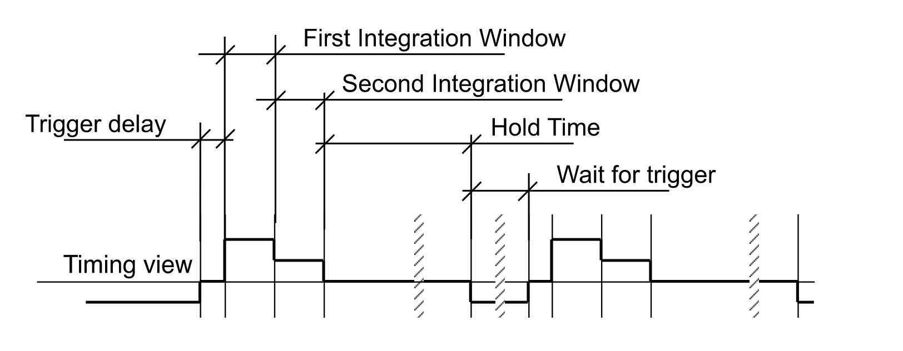

# OSCILLOSCOPE CONTROL FOR ICT-BCM SYSTEM

## Description
This project provides a LabVIEW-based control interface for an Integrating Current Transformer Beam Charge Monitor (ICT-BCM) system. Built on a Queued Message Handler (QMH) architecture, the application communicates directly with a Keysight InfiniiVision oscilloscope via VISA protocols. It features two primary operational states: a **Tuning Mode** to visually align the BCM's integration windows with incoming beam pulses, and a **Measurement Mode** for automated waveform acquisition, signal processing, and data logging to text files. This setup ensures precise timing adjustments and reliable charge data collection for beam diagnostics.

## System Requirements
*   **LabVIEW Version:** 2026 Q1
*   **Hardware Dependencies:**
    *   Keysight InfiniiVision DSOX2024A 
    *   USB or LAN (ensure the instrument is recognized in NI MAX and the VISA Resource Name is properly assigned).
*   **Drivers:**
    *   NI-VISA (for instrument communication)
    *   Agilent 2000/3000 X-Series Plug and Play Instrument Driver

## Installation & Setup
1. Clone or download the repository to your local machine.
2. Ensure LabVIEW 2026 Q1 and the necessary NI-VISA drivers are installed.
3. Install the Agilent 2000/3000 X-Series instrument driver into your `instr.lib` directory via the NI Instrument Driver Network (IDNet) if it is not already present.
4. Connect the InfiniiVision DSOX2024A and verify the connection in NI MAX.
5. Open the `.lvproj` file.

## Usage
1. Open `Main.vi` located in the root of the project structure.
2. Select the correct VISA Resource Name from the front panel drop-down menu corresponding to the DSOX2024A.
3. Select your desired operational state (**Tuning Mode** or **Measurement Mode**). This can be changed while the application is running.
    *   **In Tuning Mode:** The measurement channels are restricted to channels 1-3, corresponding to the BCM output channels.
    
    *   **In Measurement Mode:** The channel for each BCM is customizable based on the hardware connection and can be set in the Front Panel.
    
4. **TESTING Button:** If turned on, the oscilloscope will generate a trigger signal via its 'Wave Gen'. Leave this button turned off as long as an external trigger is connected.
5. Run the VI.
6. The program will automatically initialize the oscilloscope based on the initial mode and channels set. Once the oscilloscope is ready to operate, the **Initialized** button will turn on and the status bar will show **Ready**. If the status bar displays an error, exit the program via the **EXIT** button and run it again. 
7. **OPERATIONS:** 
    *   **BEGIN MEASUREMENT:** This initiates the measurement and processing operation. Measurement can be single or continuous (can be chosen via the toggle on the right of the button). While this runs, modes cannot be changed. 
    *   **STOP:** Only available when measuring 'continuous'. Stops the measurement process after the completion of the last measurement.
    *   **SAVE:** This saves the run's results. It writes to a `.txt` file at the chosen location (configurable via the 'Save to location:' filepath picker). If no `.txt` file exists at the chosen path, a new file will be created. 
    *   **EXIT:** Begins the exit process. The oscilloscope is reset and un-initialized, and the UI is reset.

> **IMPORTANT:** Always use the dedicated **EXIT** button on the front panel to exit the application. Aborting execution natively via LabVIEW will bypass the shutdown sequence, leaving the VISA session open and potentially locking the instrument.

## Tuning the BCM
In **Tuning Mode**, there are two output waveform graphs corresponding to the outputs of the BCM:
*   **Signal and Timing View (Channels 1 & 2):** Shows the measured signal by the ICT and the timing of each operation of the BCM. There are four operations:
    *   **Trigger Delay:** A delay prior to the first integration window, identified by a small rising edge. Set by default to 4 µs. This can be changed via the "Trig. Delay" potentiometer on the BCM front panel (from 350 ns to 7.3 µs). *Pulses falling within this window are not integrated.*
    *   **First Integration Window (Subtracting Window):** This window integrates the noise and baseline offset, identified by a large rising edge. Pulses within this window are integrated as 'negative' and subtracted from the final output. Set by default to 4 µs. This can be changed via the "T_w" potentiometer on the BCM front panel. 
    *   **Second Integration Window (Adding Window):** This window integrates the pulse signal, identified by a short falling edge. Pulses within this window are integrated as 'positive' and added to the final output. Ideally, the beam pulse falls within this window. Set by default to 4 µs (equal to the first integration window). This can be changed via the "T_w" potentiometer on the BCM front panel.
    *   **Hold:** The window in which the integrated signal is held for reading within the BCM, identified by a large falling edge. After this window, the output signal is reset back to 0V and cannot be restored. The hold time cannot be set separately, but is determined by the entire cycle's time. By default, the cycle time is set to 400 µs, making the hold time 388 µs. This can be changed via the "T_C" potentiometer located on the BCM board. The cycle time must not be made shorter than the sum of the trigger delay and the two integration windows.
*   **Output View (Channel 3):** Shows the output of the BCM (the integrated pulse).

Ideally, for optimized measurement, the signal pulse should fall completely within the **Second Integration Window**. 

### Adjusting the BCM Timings to Fit the Pulse
1. Run a single measurement process in **Tuning Mode** and view the resulting waveforms.
2. If the pulse does not fall fully within the second integration window (adding window), adjust the lengths of the windows as follows:
    *   If the pulse falls within the trigger delay phase, decrease the length of this window via the "Trig. Delay" potentiometer. 
    *   If the pulse falls within the "Hold" phase, increase the length of the trigger delay window via the "Trig. Delay" potentiometer. 
    *   If the pulse falls across two different phases (mainly the integration windows or the Hold window), increase or decrease the "T_w" potentiometer value.
3. Repeat the process until the intended results are received. 
4. If the pulse absolutely cannot fall within the second integration window (adding window), it is possible to place it within the first integration window (subtracting window) and change bit 7 in the DB9 connector (output signal polarity) to Low (L). 

## Architecture
This application utilizes a LabVIEW Queued Message Handler (QMH) architecture, combined with an event-based trigger loop to allow continuous interaction with the GUI. 

## File Structure
*   `BCM control.lvproj` - The main LabVIEW project file.
*   `Main.vi` - The top-level VI.
*   `controls/` - Custom Type Defs (`.ctl`) and Enums.
*   `subVIs/` - Reusable subVIs for specific tasks (scope configuration, data processing, and testing).
*   `measurements/` - measurement save files.

## Known Issues & Limitations
*   `-1073807339 Timeout error` - Occasionally occurs during oscilloscope configuration. If this occurs, EXIT the program and rerun it. If you receive the same error again, power cycle the oscilloscope and restart the VI.

## Authors
*   **Zach Oz, Ariel University** - zach.oz@msmail.ariel.ac.il

## License
This project is licensed under the MIT License - see the [LICENSE](LICENSE) file for details. This allows for both academic and commercial use, modification, and distribution, provided that the original author is credited.

## Citation
If you use this software as part of your academic research, please consider citing it:
> Oz, Z. (2026). *Oscilloscope Control for ICT-BCM System* [Software]. Ariel University.
